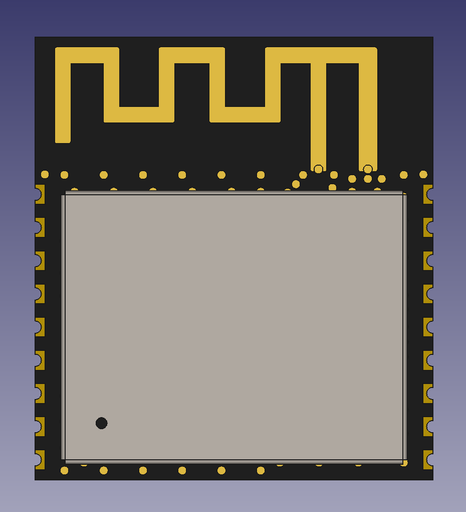
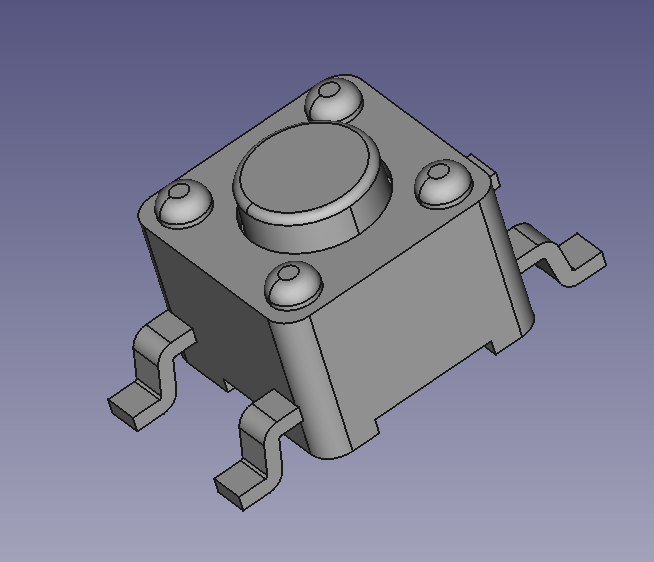
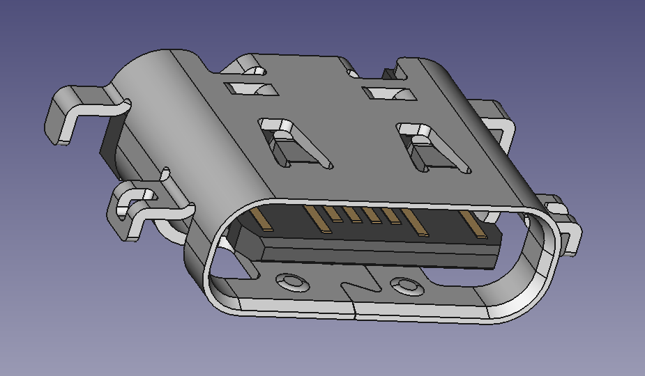
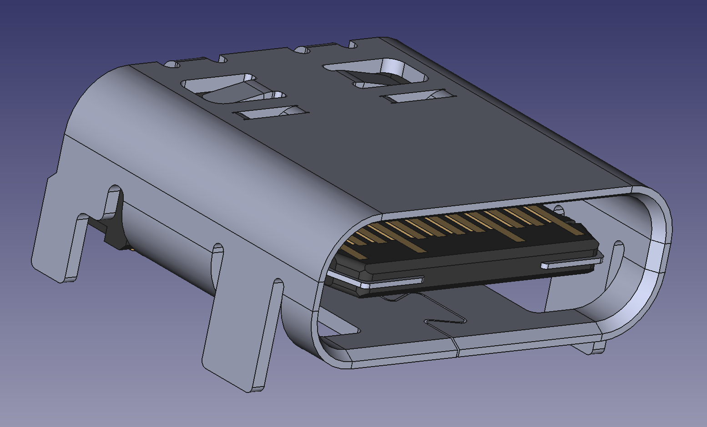
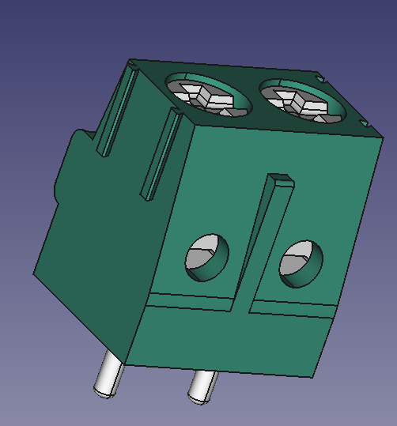
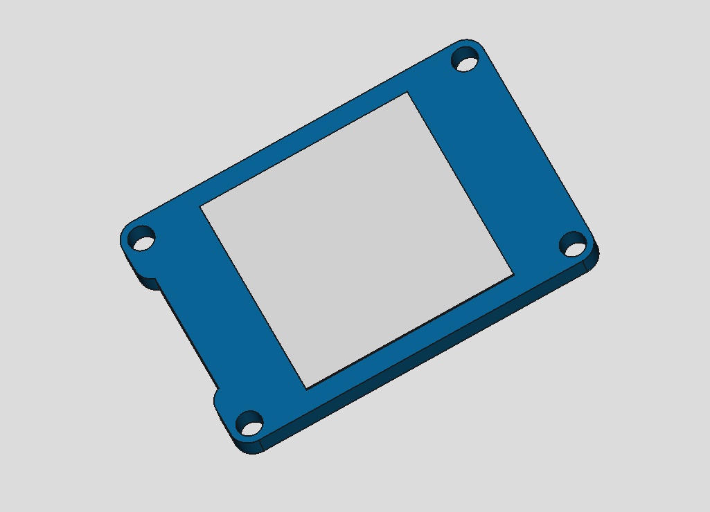

# 3D Model images

  
18650 battery

  Credit: [Grabcad](https://grabcad.com/library/inr18650-35e-samsung-35e-li-ion-18650-battery-batterie-1)

  

  
Espressif ESP32-C3

  Credit: [Espressif KiCad Library](https://github.com/espressif/kicad-libraries/tree/main/3dmodels)

  

  
E-Switch Push button TL3305AF160QG

  Credit: [DigiKey](https://www.digikey.com/en/models/5816181)

  

  
GCT USB-C USB2.0 16+8 pins

  Credit: [DigiKey](https://www.digikey.com/en/models/15283202)

  

  
Hex spacer M3

  Credit: [Grabcad](https://grabcad.com/library/hexagonal-spacers-m3-f-f-hex-5-5-1)

  

  
Micro USB-B connector

  Credit: [Grabcad](https://grabcad.com/library/micro-usb-1)

  

  
Molex USB-C 1054500101 connector

  Credit: [SnapEDA DigiKey](https://www.digikey.com/en/models/5843890)

  

  
Phoenix Screw Terminal Through-Hole

  Through-hole, 2 positions with MPN 1935161

  Credit: [SnapEDA DigiKey](https://www.digikey.sg/en/models/568614)

  

  
Push button SMD side

  Credit: [Grabcad](https://grabcad.com/library/smd-side-push-button-2x4x3-5-mm-1)

  

  
Stub antenna

  Credit: [Grabcad](https://grabcad.com/library/octane-wireless-tri-band-stub-antenna-1)

  

  
Waveshare Eink 1.54

  [Source file](../cad_files/waveshare_eink_1_54in.FCStd)

  

