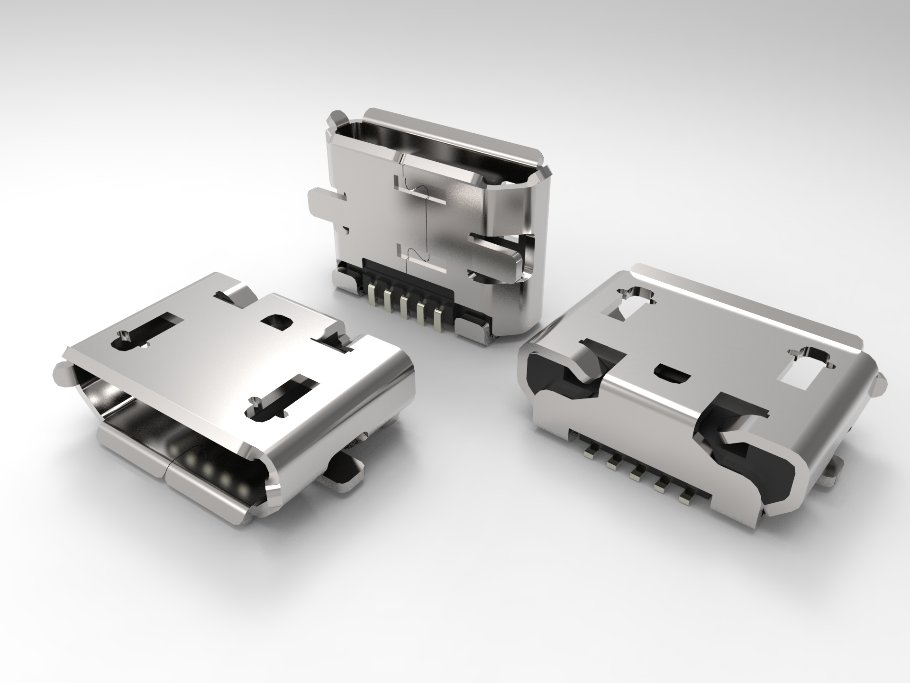
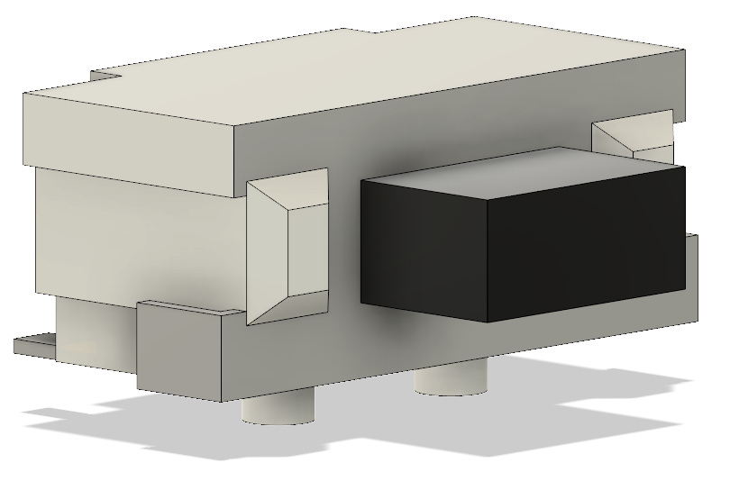
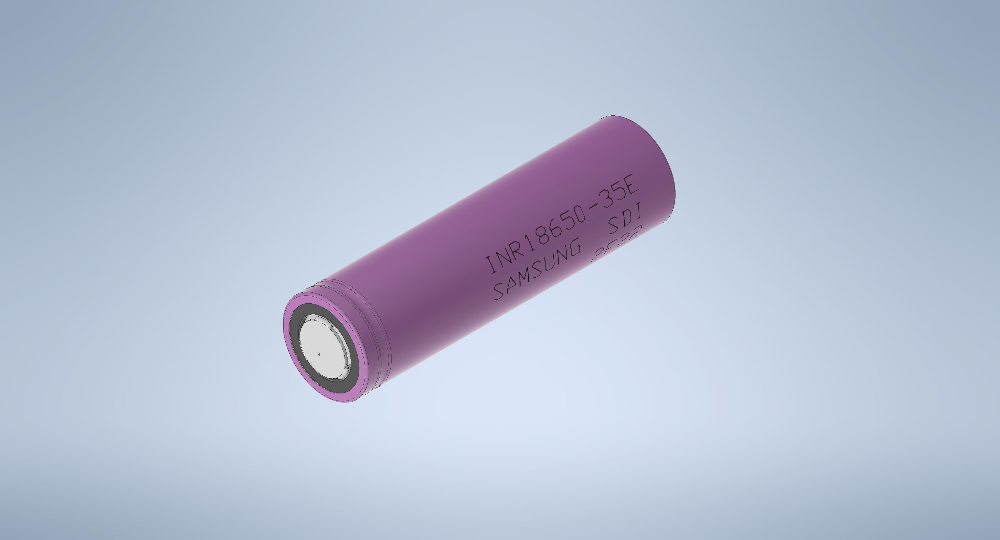
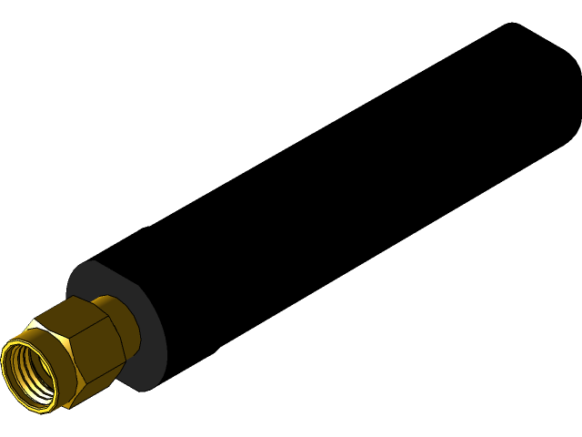
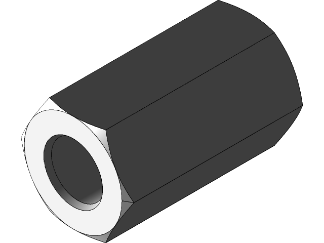

# 3D Models

- [Micro USB-B connector](#micro-usb-b-connector)
- [Push button SMD side](#push-button-smd-side)
- [18650 battery](#18650-battery)
- [Stub Antenna](#stub-antenna)
- [Hex spacer M3](#hex-spacer-m3)

## Micro USB-B connector

Credit: [Grabcab](https://grabcad.com/library/micro-usb-1)

## Push button SMD side

Credit: [Grabcab](https://grabcad.com/library/smd-side-push-button-2x4x3-5-mm-1)

## 18650 battery

Credit: [Grabcab](https://grabcad.com/library/inr18650-35e-samsung-35e-li-ion-18650-battery-batterie-1)

## Stub antenna

Credit: [Grabcab](https://grabcad.com/library/octane-wireless-tri-band-stub-antenna-1)

## Hex spacer M3

Credit: [Grabcab](https://grabcad.com/library/hexagonal-spacers-m3-f-f-hex-5-5-1)

