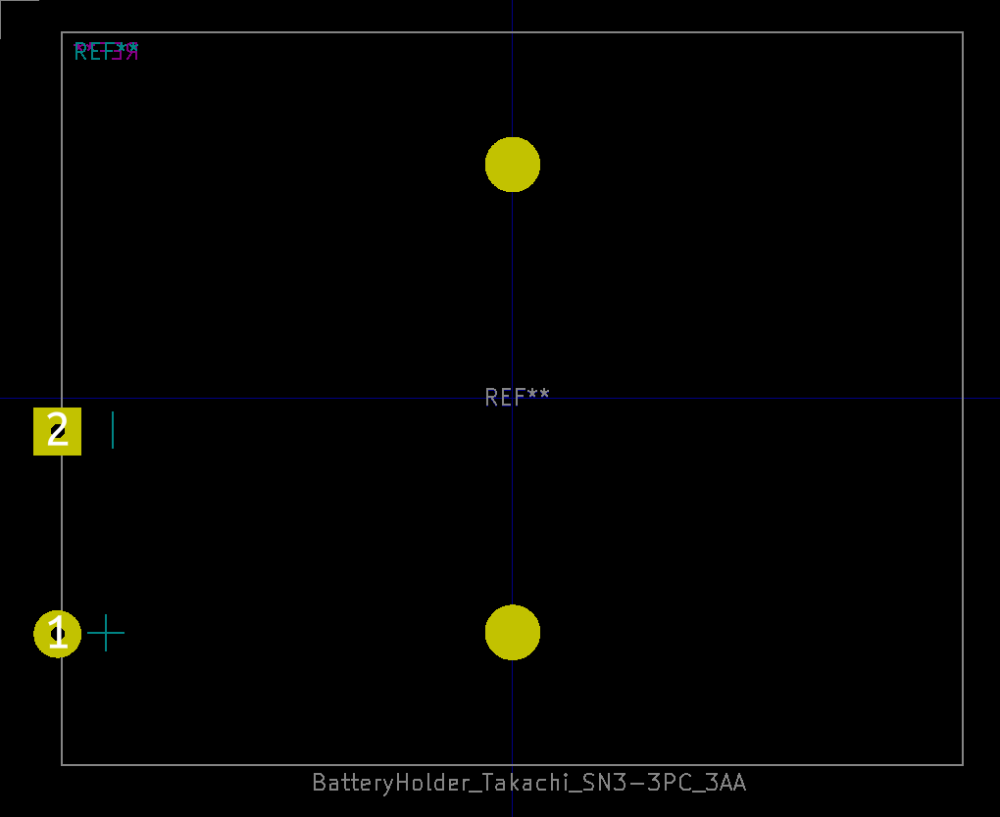
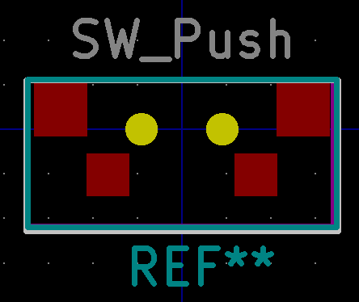
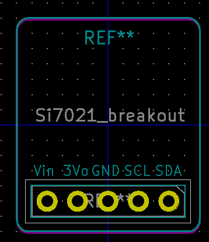
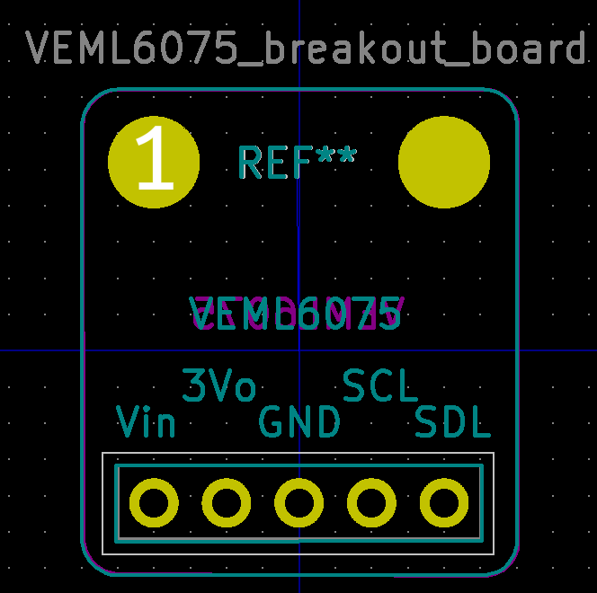
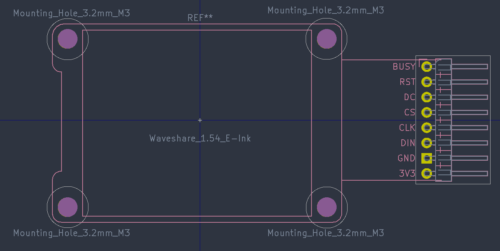
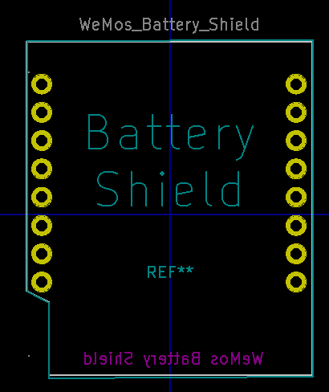

# Footprint images

  
Battery holder for 3xAA Takachi

  

  
CDTop GPS MT3333 PA1010D

  

  
CREE RGB LED 5.5mm x 5.5mm 6pin

  

  
Connector USB Micro-B Horizontal

  

  
Espressif ESP32-C3

  Credit: [Espressif KiCad library](https://github.com/espressif/kicad-libraries/tree/main/footprints)

  

  
HopeRF LoRa RFM95W-915S2

  Credit: [Swij/kicad-RFM9X](https://github.com/Swij/kicad-RFM9X)

  

  
Molex USB-C 1054500101 connector

  Credit: [SnapEDA DigiKey](https://www.digikey.com/en/models/5843890)

  

  
nRF52 Bluefruit Feather Adafruit breakout board

  

  
Panelization

  With tabs and mouse bites.
  Credits: [Panelization by madworm](https://github.com/madworm/Panelization.pretty)

  

  
Passives 0805

  Capacitor
  

  Diode
  

  LED
  

  Inductor
  

  Resistor
  

  
Push_Button

  

  
Si7021 Temperature and humidity sensor

  

  
VEML6075 breakout board

  

  
Waveshare 1.54in E-Ink module

  

  
WeMos Battery shield

  

  
WeMos D1 Mini

  

