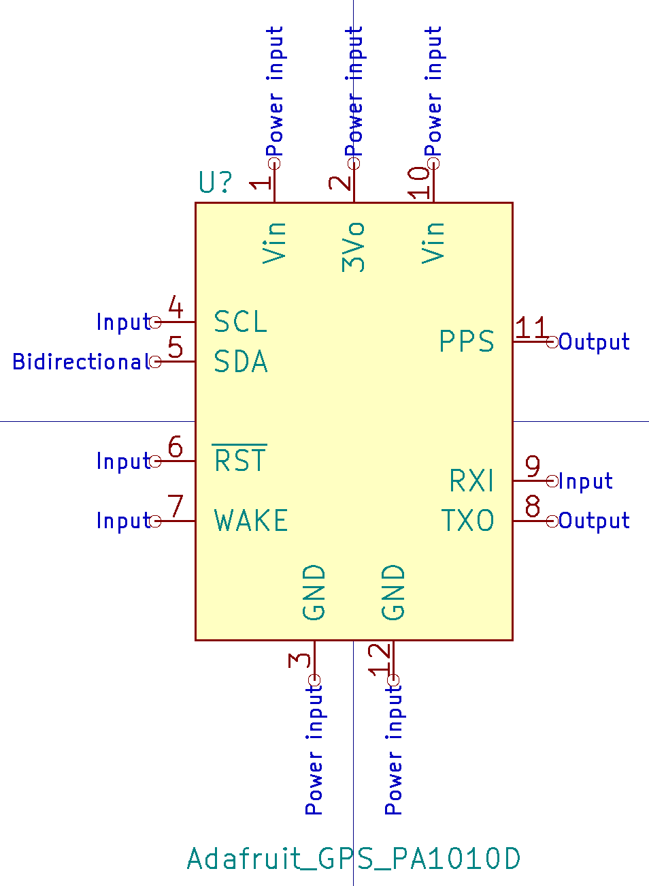
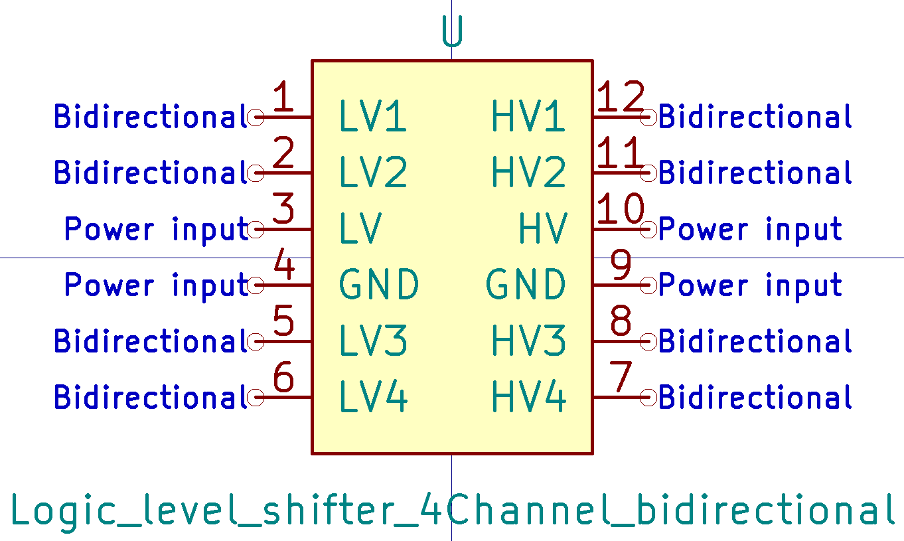
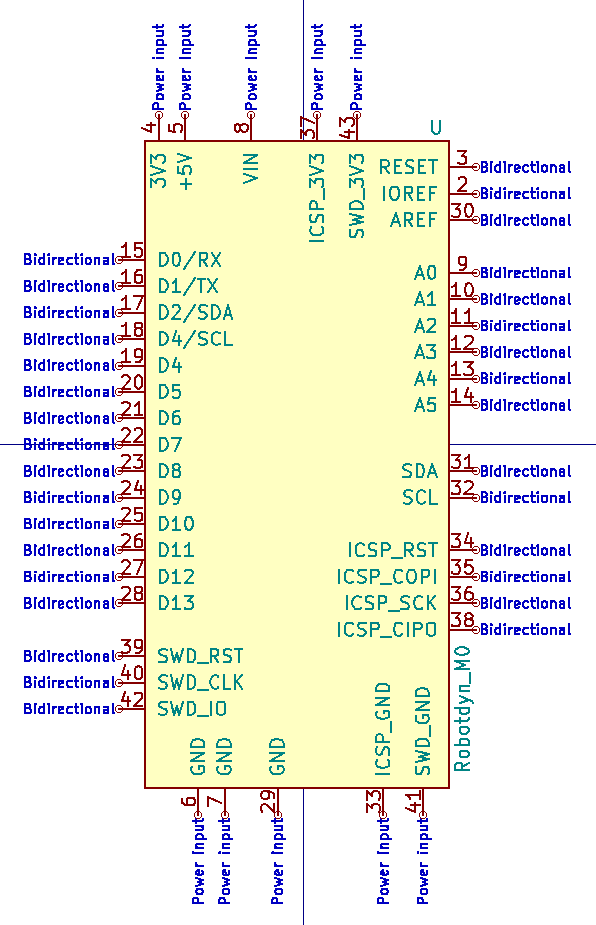
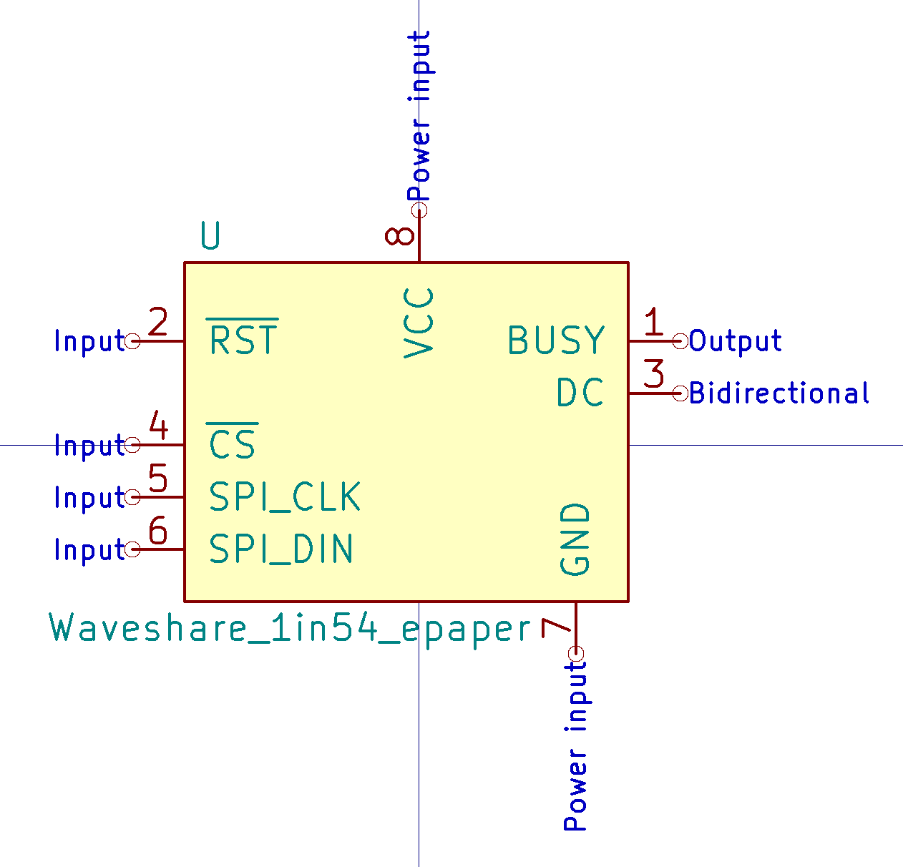

# Symbol images

  
Adafruit RFM9x LoRaWAN

  

  
Adafruit nRF52 feather

  

  
Adafruit PA1010D GPS

  

  
Adafruit sharp display

  

  
Adafruit VCNL4000 proximity sensor board

  

  
Bell Ding Dong chip TQ33E-1

  Credit: [TQ33E-1 Ding Dong 2 times Music chip](https://www.yoycart.com/Product/550682313846/)

  

  
CDTop PA1010D GPS

  

  
Espressif ESP32-C3

  Credit: [Espressif KiCad library](https://github.com/espressif/kicad-libraries/tree/main/symbols)

  

  
E-Switch Push button TL3305AF160QG

  Credit: [DigiKey](https://www.digikey.com/en/models/5816181)

  

  
GCT USB-C USB2.0 16+8 pins

  Credit: [DigiKey](https://www.digikey.com/en/models/15283202)

  

  
Logic Level shifter 4-channel bidirectional

  

  
Molex USB-C 1054500101 connector

  Credit: [SnapEDA DigiKey](https://www.digikey.com/en/models/5843890)

  

  
Phoenix Screw Terminal Through-Hole

  Through-hole, 2 positions with MPN 1935161

  Credit: [SnapEDA DigiKey](https://www.digikey.sg/en/models/568614)

  

  
RaspberryPI Pico dev board

  Credit: [blippy on GitHub](https://github.com/blippy/rpi/tree/master/pico/kicad)

  

  
Robotdyn SAMD21 M0 mini

  

  
SiLabs CP2102 USB to UART bridge

  

  
SiLabs Si7021 breakout board

  

  
Vishay VEML6075 UV sensor

  

  
Waveshare E-paper 1.54inch

  

  
WeMos ESP8266 battery shield

  

  
WeMos D1 mini

  

